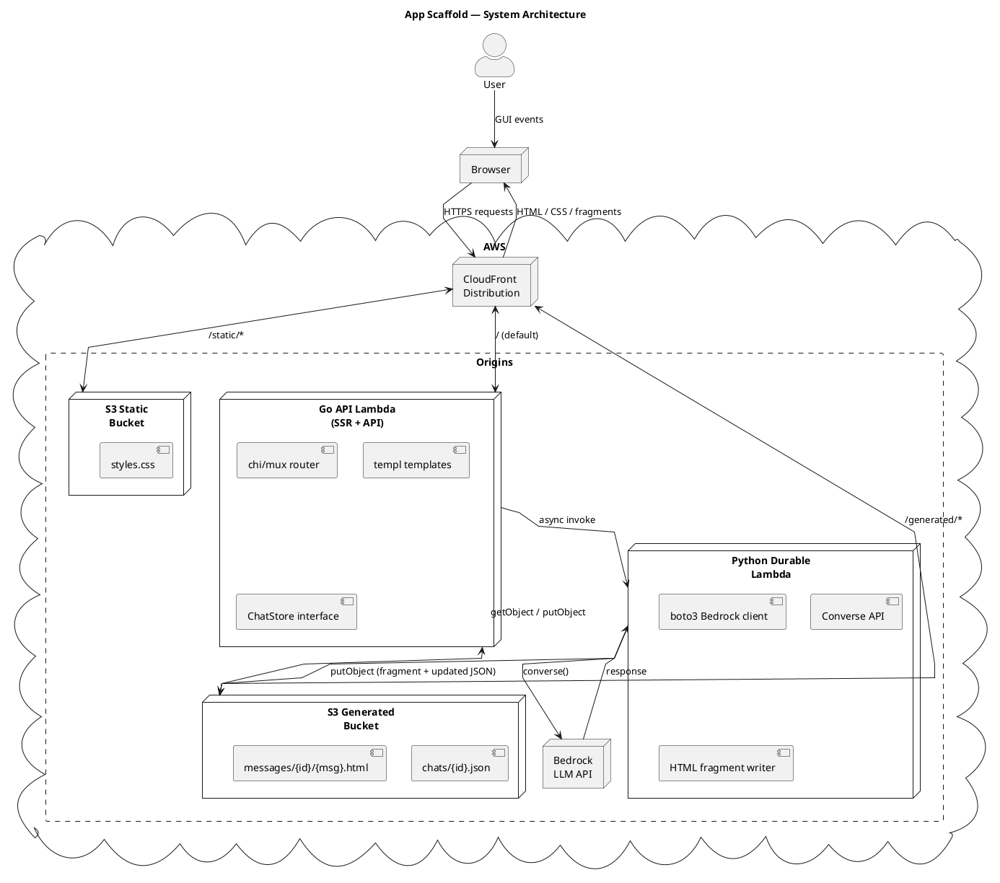

# Architecture

## Overview

The app scaffold implements a **serverless HTML-over-the-wire** architecture on AWS,
designed for near-zero cost at low usage, elastic scalability, and portability.

All traffic enters through a single CloudFront distribution that routes requests to
three origins: S3 for static assets, S3 for generated content fragments, and a Go
Lambda for server-side rendered pages and API endpoints. Long-running LLM calls are
offloaded to a Python Lambda invoked asynchronously.

## Design Goals

| Goal | Approach |
|------|----------|
| Low cost at low usage | Serverless compute (Lambda), pay-per-use storage (S3), CloudFront free tier |
| Elastic scalability | Lambda auto-scaling, S3 unlimited storage, CloudFront global CDN |
| Replatformable | Business logic in portable Go packages, templates compiled to Go, frontend is static HTML |
| Simple to develop | Local FS backend for dev, no Docker required for dev loop |

## System Diagram



## Origins & Behaviours

CloudFront is configured with three origin groups and path-based routing:

| Path Pattern | Origin | Purpose |
|-------------|--------|---------|
| `/static/*` | S3 Static | Tailwind CSS output, future static assets |
| `/generated/*` | S3 Generated | Chat JSON state + HTML fragments (private) |
| `/*` (default) | Go Lambda Function URL | SSR pages, form handling, polling API |

Both S3 buckets use **Origin Access Control (OAC)** — no public access. CloudFront
is the only entity that can read from them.

## Go API Lambda (`cmd/api`)

The API Lambda handles all dynamic requests. It uses the standard library
`net/http` mux (or chi for readability) adapted to Lambda via the
`aws-lambda-go` package.

**Responsibilities:**
- Render full chat pages via `templ` (SSR)
- Handle message form submissions (POST)
- Respond to polling requests (GET)
- Read and write chat state on S3
- Invoke the Python Durable Lambda asynchronously

**Dependencies (Go modules):**
- `aws-lambda-go` — Lambda runtime adapter
- `aws-sdk-go-v2` (s3, lambda) — AWS service clients
- `templ` — HTML template engine
- `uuid` — Chat and message ID generation

**`ChatStore` interface** abstracts S3 vs local filesystem:

```go
type ChatStore interface {
    GetChat(ctx context.Context, chatID string) (*Chat, error)
    SaveChat(ctx context.Context, chat *Chat) error
    GetFragment(ctx context.Context, chatID, msgID string) ([]byte, error)
    PutFragment(ctx context.Context, chatID, msgID string, html []byte) error
}
```

Two implementations:
- `S3Store` — production, reads/writes to S3 Generated bucket
- `FSStore` — development, reads/writes to `./data/` directory

Selection via `APP_ENV` environment variable (`production` vs `development`).

## Python Durable Lambda (`lambdas/durable`)

The Python Lambda handles all asynchronous LLM processing. It is invoked
by the Go API Lambda using `InvocationType: Event` (fire-and-forget).

**Responsibilities:**
- Load chat history from S3
- Call Bedrock Converse API with conversation messages
- Render the response as an HTML fragment
- Write the HTML fragment to S3 (`messages/{chatId}/{msgId}.html`)
- Update the chat JSON on S3 (set status=complete, fragment=path)

**Why Python?**
- Native `boto3` support (no extra dependencies)
- Easier to integrate with AI/ML libraries (langchain, llamaindex) later
- Bedrock Converse API ergonomics are better in Python

## DynamoDB Decision (Deferred)

The scaffold starts with **S3-only** persistence. Chat state is stored as JSON
files in the S3 Generated bucket. DynamoDB is not provisioned in v1.

**Rationale:**
- No relational or query needs at this stage
- S3 is simpler and cheaper for document-style data
- Keeps the scaffold minimal

**Migration path:** The `ChatStore` interface allows swapping in a DynamoDB
implementation without changing handler code. Add a `DynamoDBStore` when you need
query patterns beyond "load chat by ID".

## Frontend

Zero-build frontend. All HTML is server-side rendered by Go via `templ`.

| Technology | Role | Loaded From |
|-----------|------|-------------|
| HTMX | Dynamic HTML swaps, form submissions, polling | CDN (`unpkg`) |
| Alpine.js | Client-side interactivity (scroll, form state) | CDN (`unpkg`) |
| Tailwind CSS | Styling | S3 Static (`/static/styles.css`) |

**Build step:** Only Tailwind CSS compilation (`npx @tailwindcss/cli`). No
TypeScript, no bundler. Alpine.js and HTMX are loaded via `<script>` tags
from CDN.

## Auth (Deferred)

Auth is out of scope for v1. The scaffold uses a single shared chat: anyone
who visits gets the same conversation. This keeps the scaffold focused on
the architecture pattern.

**v2 additions:**
- Session cookie → chat ownership
- API key or Cognito for multi-tenancy
- Chat isolation per user
