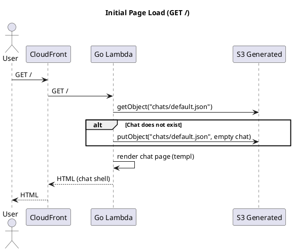
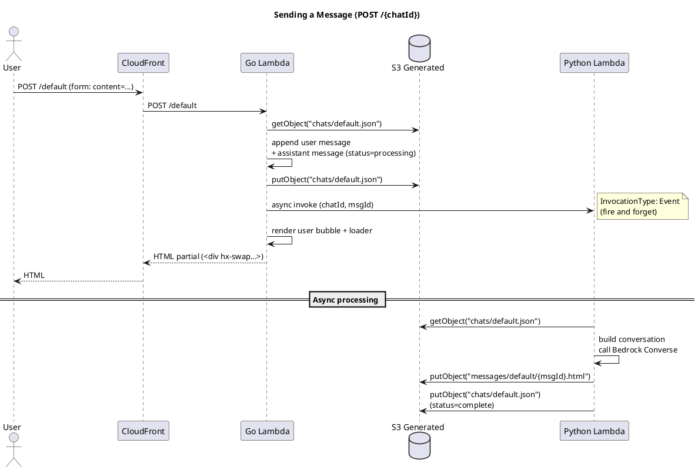
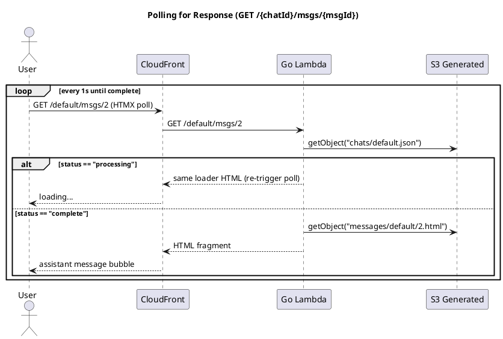
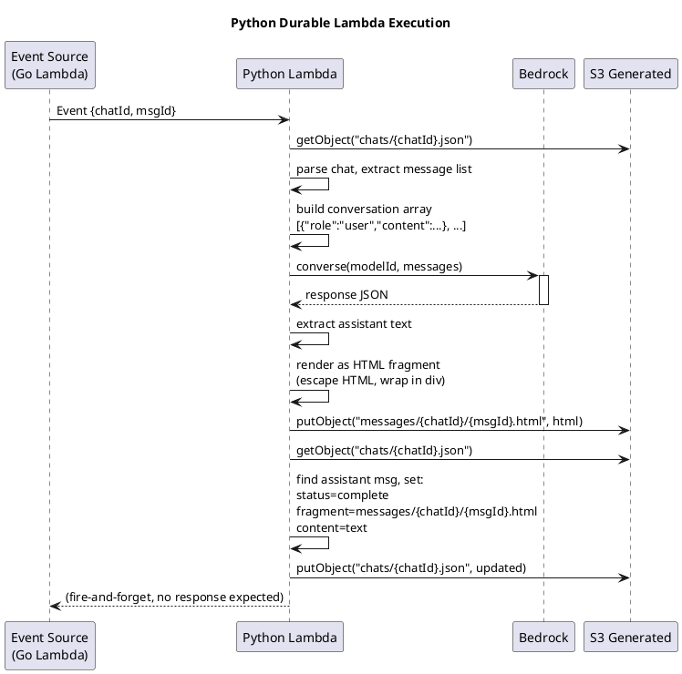
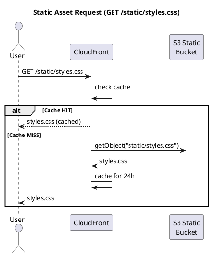

# Request Flows

## 1. Initial Page Load



**Steps:**
1. User visits `/`
2. CloudFront routes to Go Lambda
3. Lambda reads `chats/default.json` from S3 (or creates empty chat)
4. Lambda renders full chat page with all messages as HTML via `templ`
5. Chat is ephemeral — single shared `default` chat for v1 (auth deferred)

**Response:** Full HTML page with the chat shell, message list, input form, and
Tailwind CSS reference.

---

## 2. Sending a Message



**Steps:**
1. User submits form via HTMX (`POST /default`)
2. Go Lambda receives request, reads current chat from S3
3. Appends:
   - User message (`role=user`, `status=complete`)
   - Assistant placeholder (`role=assistant`, `status=processing`)
4. Saves updated chat JSON to S3
5. Invokes Python Lambda asynchronously (`InvocationType: Event`)
6. Returns HTML partial with:
   - The user's message bubble
   - A loading placeholder with HTMX polling attributes

**Response HTML:**
```html
<div id="messages" hx-swap-oob="beforeend">
  <!-- User message -->
  <div class="message user">Hello</div>
  <!-- Loading placeholder (polls itself) -->
  <div hx-get="/default/msgs/2"
       hx-trigger="every 1s"
       hx-swap="outerHTML">
    <div class="loading">...</div>
  </div>
</div>
```

---

## 3. Polling for Response



**Steps:**
1. HTMX polls `GET /default/msgs/{msgId}` every 1 second
2. Go Lambda reads chat JSON from S3
3. Checks message status:
   - `processing` → returns same loader HTML (HTMX re-triggers the poll)
   - `complete` → reads HTML fragment from S3 (at `fragment` path), returns it
4. When complete, HTMX swaps the loader out and the assistant message appears

**Processing response (re-triggers poll):**
```html
<div hx-get="/default/msgs/2"
     hx-trigger="every 1s"
     hx-swap="outerHTML">
  <div class="loading animate-pulse">Thinking...</div>
</div>
```

**Complete response:**
```html
<div class="message assistant" id="msg-2">
  <p>Hello! I'm Claude. How can I help you today?</p>
</div>
```

---

## 4. Python Durable Lambda



**Steps:**
1. Receives invocation event with `chatId` and `msgId`
2. Loads chat JSON from S3
3. Builds conversation array from all non-processing messages
4. Calls Bedrock Converse API (`bedrock-runtime.converse`)
5. Extracts the assistant's response text
6. Renders it as an HTML fragment (safe HTML escaping)
7. Writes fragment to `messages/{chatId}/{msgId}.html`
8. Updates chat JSON: sets `status=complete`, `fragment=path`, `content=text`
9. Returns (no response to caller — async invocation)

**Bedrock Converse API payload:**
```python
response = bedrock.converse(
    modelId=model_id,
    messages=messages,
    inferenceConfig={
        "maxTokens": 1024,
        "temperature": 0.7,
    }
)
text = response["output"]["message"]["content"][0]["text"]
```

---

## 5. Static Asset Request



Static assets are served from S3 with CloudFront caching. In v1, the only
static asset is the compiled Tailwind CSS file. Future assets (images, fonts)
follow the same path.

The `styles.css` file is generated by `@tailwindcss/cli` from `web/css/input.css`
and uploaded to S3 during deployment by CDK.

---

## S3 Chat Data Format

```
generated-bucket/
├── chats/
│   └── default.json          # Single shared chat for v1
└── messages/
    └── default/
        ├── 1.html            # (user messages don't get fragments)
        ├── 2.html            # Assistant response as HTML fragment
        └── 3.html
```

**`chats/default.json`:**
```json
{
  "id": "default",
  "messages": [
    {
      "id": "1",
      "role": "user",
      "content": "What is HTMX?",
      "status": "complete"
    },
    {
      "id": "2",
      "role": "assistant",
      "content": "HTMX is a JavaScript library...",
      "status": "complete",
      "fragment": "messages/default/2.html"
    },
    {
      "id": "3",
      "role": "assistant",
      "status": "processing"
    }
  ]
}
```
